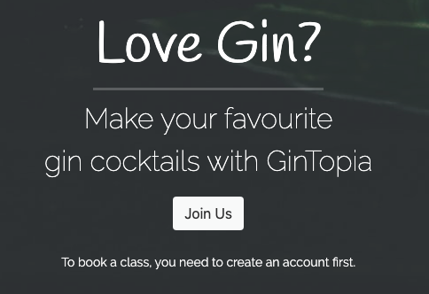

# GinTopia

## Introduction
GinTopia is a cocktail events bar and hosts classes, where people come to learn how to make their favourite gin-based cocktails and discover new flavours they may have not encountered before. Their aim is to inform people on the different types of gin and what role these gins have. For example, Ableforth's Bathtub Gin is great for a dry martini, whereas, Four Pillars Olive Leaf Gin, is best for a dirty martini.

Intrigued visitors can book a class directly on the website and see their booking(s) in one place, where they can edit or delete their booking(s). However, they must create an account and be logged in to create a booking. This is an opportunity for GinTopia to collect user data and use it for marketing purposes if they wish to do so.

## User Stories & Project Goals
GinTopia had a vision on what they would like to achieve from their website. They mapped out the needs from a customer and developer’s point-of-view and constructed manageable tasks for the challenge to be accepted and tackled. Below is a table of the user stories that derived at the beginning of planning and if/how they were implemented on GinTopia.

User Story | Project Goals
-------- | --------
As a customer, I can edit and delete my bookings, so that I can be in control of my bookings. | This was achieved in the “Your Bookings” page, where a user can select a booking and choose whether to edit or delete any booking that they have made.
As a developer, I can limit access to certain pages, so that only logged in users can book a class and view their bookings. | This was achieved using an “if statement” in the navigation section. If a user was logged in they would have access to all pages within GinTopia. If a user wasn’t logged in, they had access to fewer pages, e.g., no access to create, read, update or delete a booking.
As a customer, I can instantly know what the purpose of the website is, so that I can click on the relevant buttons/path, to get me to book a class. | This was achieved on the homepage. Where the card title and subtext instantly let a visitor know what the website is about and that they must create an account before they can book a class. So, it’s clear to the user, what actions they must take first, before they can book a class.
As a customer, I can create a booking and choose which mixologist I want to be taught by, so that I can learn from their experience and someone who has similarities to myself. | This was achieved on the “Book a Class” page. Where a user can create a booking and choose which mixologist they would like to be taught by. They can make this decision based on the topline detail of each of the mixologists that work at GinTopia, which is listed under the booking form.
As a developer, I can ensure the steps to log in and out are simple, so that users can create accounts and create bookings with ease. | This was achieved utilizing Django’s template login, log out and sign-up html files. So, if a user clicks on the sign-up page, but already has an account, they can click on the same page and be redirected to login page. And if a logged in user wants to logout, they can navigate to the top-right-hand corner and click logout. Where they will see a page asking them to confirm their decision to logout. It’s a user-friendly setup, which is easy to navigate through.
As a customer, I can send an email to GinTopia, so that I can make sure they see any enquiries that I have. | This was achieved on the “Contact Us” page. A user would need to fill out their name, email address and enquiry, to be able to send a successful submission. They will be notified that the enquiry has been successfully sent via an alert pop-up.
As a developer, I can direct users to book a class on any page, so that they don't need to go back to the homepage every time. | This was achieved via the footer on every page. When a user is logged in, they will have a call-to-action button stating, “Book Now”, which will lead them directly to the “Book a Class” page, where the booking form is. 
As a customer, I can learn about the different types of gins there are, so that I can make famous gin cocktails with the right type of gin. | This was achieved on the “All About Gin” page. On this page, it’s listed the different categories of gin and what gin ranks best in that category. Each bottle comes with a description about it, to educate the visitor on that gin. It also advises what role some gins have, for example, the Ableforth’s Bathtub Gin, is best for a dry martini.

## Project Design
The project design is split into 3 parts: the appearance of the website, access levels and the structure of the database.

### The Appearance
* The brand name is a mixture of two elements. The first being the name having the “G” and the “T” capitalized. This is so it will remind users of the classic drink “Gin & Tonic” also known as “G&T”, which this website is focused on. Secondly, it plays on the word “utopia”, which is synonymous to the words, paradise, heaven on earth. For those who have a passion for gin, experiencing great tasting cocktails can bring those feelings to life. Hence, combining G&T and utopia into one, we get GinTopia.

* The colour scheme derived from a Google image of a Rangpur gin bottle, which consisted of gold, green, white and brown tones. This was initially going to be the homepage hero image. But due to the white background and details on the bottle, it would be quite difficult for a user to understand any overlaying text. Therefore, a contrasting, dark image was used instead, which gives a seductive, inviting feel, yet encompasses the warmth tones around it.

* The font used for the brand logo and larger headers was “Handlee” from Google Fonts. It was chosen due to its cursive nature, which can be quite inviting and seductive if used in moderation. Hence why, HTML heading tags 1, 2 and 3 were styled to have “Handlee” as the given font and the remaining 3 heading tags (4, 5 and 6) were assigned “Raleway”. Which is a font that would fall into a sans-serif category, making it an easy font that visitors can read, and it complements the “Handlee” font quite well.

* The imagery on the homepage was chosen for its dark, sophisticated, alluring route, encouraging visitors to be tempted to book a class. On the hero image, there is a call-to-action (CTA) button overlayed, and this was done to drive visitors to book a class. Where the aim to give visitors a taste of what the venue would be like when they come to visit; dark, attractive with an element of mystery.

* This style was continued on the booking form pages, to once again give an insight into what kind of experience they may have at the gin-cocktail making class.

* Every page on the website has the same styled footer, with links to social media pages. (If this was a real company, the social buttons would link to GinTopia’s social media pages). The footer also includes a CTA button and copyright text for GinTopia. The footer is needed on every page as it’s an opportunity for a user to book a class after scrolling down a page that they’re consuming; it gives the page structure and a professional look and feel. It’s important to be present with the website’s goal (Book Now), without being intrusive, which can lead to a negative user experience.

### Role Access
* GinTopia wants to offer the opportunity for visitors to book a class, but they must create an account to do so. Part of the booking process requires users to provide an email and phone number for the form to be valid. This means GinTopia can leverage this data for future marketing purposes.

* Those who create an account will have the booking form page visible to them, as well as a “Your Bookings” page, where they can see the booking(s) they have made.

* If a visitor does not create an account, they have access to fewer pages, specifically the homepage, “All About Gin” page, “Contact Us” page as well as the opportunity to sign up at the top right-hand corner in the navigation bar.

* Additionally, if a user hasn’t created an account nor logged in, their CTA buttons will differ to those who are logged in. 

* Logged in CTA 
* Not logged in CTA 

### Database Structure
* The database is made up of two models, a Reservation model and a Mixologist model. It was created like this for two reasons.
    * For the first reason, on the booking form page, logged in users can see the mixologists that work for GinTopia and see their name, age, experience and their favourite gin cocktail. This display is provided to the visitor so that they can choose which mixologist they would like to be taught by. For the purpose of this project, the Mixologists work every day. This gives the user a choice and a small element of control on how their experience may pan out.

    * The second reason is for the purpose of scheduling. Due to the Mixologist model being linked to the Reservation model, if a Mixologist is suddenly unable to attend a shift, any bookings associated to them, will be deleted. One of the future features to be implemented is a text and/or email to notify a user a change to their booking from the Django administration backend.

    * The database captures a host of user data, including name, age, gender, email, phone, as well as the time and date of their booking, how many people are they booking on behalf for and the mixologist they wish to be taught by.

    * This data can be filtered in a few ways, so that the admin can see which booking records fall under specific search/filter criteria.

## Current Features

Features

### Homepage
* The homepage consists of 3 sections, the hero image, customer reviews and gallery.
    * Hero Image
        * The hero image, which is using Bootstrap’s jumbotron component, is a great way to capture a user’s attention but also direct them to the site’s main goal of booking a class.

        * The title, “Love Gin?” was done like this, so a visitor would know instantly that this website is about gin. Secondly, the subtitle text below, gives more information to the visitor that there is an opportunity to make gin cocktails with GinTopia.
        
        (This is the logged in view, as the CTA says Book Now)
        
        (This is the logged-out view, as the CTA says Join Us. There is also a disclaimer stating that users need to create an account before they can book a class, so they are aware of the steps they need to take.)

        * The mobile hero image is different due to the yellow gin image not being clear what the image is on smaller devices. It was decided to use a background of a clear G&T drink that has decorative leaves and lemon in the glass. The dark contrast is consistent with the website’s theme, and it allows the overlaying text to be clear to the visitor. 
        
        
        
        (Logged in view)

        
        
        (Logged out view)

    * Customer Reviews
        * The customer reviews are displayed in an owl-carousel format, so each card pops forward when it’s in the center. This is done to draw attention to the review, before the next one appears.

        * Including reviews is a good way to entice people to book a class, as they can see other people have enjoyed themselves and willing to come back, which is great for business.

        

    * Gallery
        * The gallery is included to show users the type of dark and alluring setting GinTopia has, but also an example of some of the drinks they will get to make and some of the gin we will use in the cocktails.
        
        * It’s currently a list of 4 images, but a future implementation, would be to dedicate an entire page to gallery photos that a visitor could scroll through.

        * Depending the screen size, a visitor is viewing this website on, they will either see an array of 4 images of a slideshow on a small device, consisting of the same images.

        
        (Large tablet/desktop view)
        
        (Small tablet/mobile view)

### All About Gin
* This page was designed so that visitors could be informed about the different gin categories there are and what gin brands/flavours rank the best in their category. There are 10 gins listed on this page, each with the name of the bottle, the alcohol percentage volume, the price, a button leading to Amazon, where they can buy the bottle and a description of the gin.

### Book A Class / Update Booking
* These pages consist of two parts; the booking form and an introduction to the mixologists, who will be teaching the classes.
    * Booking Form
        * The form consists of various data inputs that were originally set up in models.py. The admin and owners of GinTopia want to know this data from their visitors, not just to facilitate classes, but to also know about the people booking these classes and using this information for future marketing campaigns.

        * For this form to submit, all fields need a valid input. This is due to either having the required attribute added to the form field in the html file or making sure blank and null are false in the models.py.

        * In addition to this, to ensure the information that’s fed through to the database contains usable data, minimum and maximum limits have been implemented and the type of data that needs to be inputted. For example, for the mobile field, it needs a minimum of 11 digits, given that UK mobile numbers consist of 11 digits and the minimum age is 18, because you need to be at least 18 years old to drink alcohol in the UK. In addition, the date field, has the attribute type of date, so the date picker appears. Validator code was added to the models.py so that a user couldn’t pick a date in the past to reduce invalid bookings.

        * GinTopia has classes that run from 1pm – 9pm at 2-hour intervals. Therefore, there are a selection of times a user can choose from.

        * It is also at this opportunity, where users can choose which mixologist they would like to be taught by. This list was curated in the Django Administration and pulled through to display on the user interface.

        
        (Booking for display)

        * The update booking form is the same layout, except the heading differs, as the action is different and the CTA says, “Update Booking”, rather than “Book Now”, when users are making a new booking.

        
        (Update booking form display)

    * Mixologists
        * At the bottom of the booking forms, there is a display of the mixologists, who will be teaching the classes. This was done, so visitors could get an idea of who these people are and decide which mixologist they wanted for the class.

(Large tablets/desktop view)

(Small tablets/mobile view – a slideshow of the mixologists and snippet of info about them)

### Your Bookings
* When a book is successful, the user is redirected to the “Your Bookings” page.

* An important security measure was taken to ensure that users only saw the bookings that they made. This is to protect the privacy of user’s details being shared with unauthorized people. Only the admin who has superuser access to the Django Administration, can see all the bookings every logged in user has made.

* When they arrive on the page, they are notified with a success alert that their booking was created successfully.

* Bookings are listed in order of date, so upcoming bookings are listed at the top. Each booking shows important details the user may want to edit. Such as, email and phone number for contacting purposes and then the core booking information, such as date and time of the booking, the number of people attending and the mixologist.

* At the end of each booking row, the user has the opportunity to edit or delete the booking.

* If they choose to edit the booking, they will be redirected to the update booking page and be able to fill the form in. Once submitted, the old booking row will be updated with the new inputs and the user will be notified that the update was successful. As you can see in the image below, we have updated the top booking and changed the class time to 1pm and 4 people are now attending.

* If the user chooses to delete a booking, this can be done in two steps. First, they will click the delete button. Then a modal will pop up and ask if they’re sure they want to delete the booking. If they click yes, the booking is deleted, and they will receive an alert that this action was processed successfully. If they click close, then no booking has been deleted. This modal was implemented as defensive programming, so no accidental deletions could be made without the user confirming their actions.

(Step 1 – Decide which booking you want to delete and then click “Delete”)

(Step 2 – User chooses if they want to proceed with deleting the booking or cancel it by clicking “Close”. If they choose to proceed, then they will click “Yes, Delete”.)

(Selected booking has been deleted and the user has been notified of this via a success alert).

* Lastly, if the user would like to add another booking, instead of clicking on the navigation tab, they can scroll to “Add a booking” and the user will be directed to the booking form page.

### Contact Us
* This page is great for visitors who have any questions or want to make requests for their booking, such as “Can I host a private event from 5pm-9pm?”

* The page displays 2 main elements, a contact form and a map of the location. The map and address were included to reduce enquiries on where the event was.

* When a user submits their enquiry, an alert box pops up confirming that their enquiry was sent successfully.

* For testing purposes, the developer can open the devtools and check the console if the enquiry was sent successfully or not.

* In our JavaScript code, it’s setup so if the booking is successful, the word “SUCCESS” would be visible. If unsuccessful, “FAILED”, would appear.

* EmailJS was the service used to create a working contact form, which would allow admins or customer support to receive enquiries and be able to respond to users, given that they would need to supply their email address.

* With the account used to receive these enquiries, you can see the email come through in the below image.

* The Google map is hosted from the Google Map API. For the purpose of this project, an existing place was chosen, so it was clear to the user what roads are nearby, which can help with finding a place. The user also has options to use the zoom feature or see the terrain version of the map, if this option suits them better to find GinTopia.

### Sign-Up / Login / Logout
* Depending on which user access they have, they will see different navigation links.

(No user account created yet. Only have access to 3 pages besides the sign up/login pages)

* When the user clicks to sign up and create an account. They will see the below form.

* All fields must be completed, except for the email field, which is optional. Usernames must be unique, so if a user’s name is taken, they may need to add some characters, such as additional letters, numbers to make their username unique. And the passwords the user inputs must be the same, for the form to be valid and submitted. 

(Logged in, with confirmation that they have successfully logged in. They will also have access to book a class and view, edit and delete their booking (CRUD))

* If the user chooses to sign out, they will be asked to confirm this action, once again defensive programming.

* If the user clicks “Sign Out”, they will be redirected to the homepage, with a success alert, stating they have signed out.

* Once the user has created an account, if they choose to come back to the site, after they have logged out, they can click on the “Login” button and be directed to the below page. It’s likely their data would be stored already in the input fields, for an easier log in experience. They have the option to click “Remember Me”, if they wish for a smoother login process in the future.

### Footer
* The footer, which is consistently display across every page is there to serve two functions. Direct users to GinTopia’s social media pages and encourage users to either book a class or create an account depending on their logged in status.

(Logged out or not created an account yet)

(Logged in – can book a class straightaway)

## Future Implementations
* Add a fun facts page about gin.

* Add a gallery page for all the images GinTopia and visitors have taken.

* Be able to send a mass cancellation email to all clients who have booked a class with a mixologist, who can no longer host the event.

* Implement a dynamic pricing API from Amazon, or another retailer, so the prices on the “All About Gin” page are always up to date.

* Create a script so that only a certain number of people can book a class at any given date, to reduce large classes.

* Users will be able to select multiple bookings to delete in one go.

## Testing

    
Tests Conducted

### Automated
* The automated coverage report results at 88%. The remaining 12% of tests is covered under manual testing.

### Manual
Lanuague | Test | Outcome
-------- | -------- | --------
JavaScript | Enquiry Email via EmailJS | If all fields have been filled in and the data inputted is valid, the enquiry will submit successfully, with a status 200. A JavaScript alert will notify the user that the enquiry has been sent and the email associated with the EmailJS service will receive the enquiry. 
JavaScript | Owl Carousel | With the rotating carousel, we can visually see the cards rotate every 10 seconds, which was set on the script. This is so users have enough time to read each review before the next card appears.
Python | Confirmation Alerts | When a user does an action, such as login, log out, create, edit or delete a booking, they are notified with an alert at the top of the page that their action has been successful. They are then redirected to the “Your Bookings” page, in case they want to edit any more bookings or delete booking(s).
Django | Administration Backend | To show that the model strings return as either first name for the Mixologist model and user’s email for the reservation, please see the images below: Mixologists - First Name  Reservation - User Email 

### Validation Checks
* HTML W3C Validator – No errors found

* CSS3 Jigsaw Validator – No errors found

* Pep8 – No errors except in settings.py and manage.py

* JShint – No errors except for config.js

* Heroku works correctly as planned across Google Chrome, Safari, Microsoft Edge and Mozilla Firefox

* Tested the Heroku program on iPhone 11, Google Pixel 2, Motorola Edge and Huawei P9

## Project Bugs & Solutions

### Resolved
Bugs | Solutions
-------- | --------
Modal - The purpose of including the modal on the “Your Bookings” page, was to act as a last defensive mechanism before a user confirmed that they wanted to delete their booking. Prior to including this modal, the correct booking was deleted. When including the modal, the booking at the top of the list was deleted, instead of the booking that should have been deleted. | Replaced the Bootstrap standard template `data-bs-target="#exampleModal"` with `with data-bs-target=”#exampleModal-{{item.id}}”` and replace `div class="modal fade" id="exampleModal"` with `div class=”modal fade” id=”exampleModal-{{item.id}}”`. This additional piece of code told the website to target the specific item.id instead of deleting the top option in the bookings table.
Server 500 Error – Visitors, who were signing up for the first time, were experiencing a server 500 error when they included an email in the sign-up form. The error didn’t explain what the error was or tell them that their account was created regardless of the error. Meaning this left some users to not continue with the website, which meant no bookings for GinTopia. | Include `EMAIL_BACKEND = "django.core.mail.backends.console.EmailBackend"` into the settings.py file, so that the website will accept the email address inputted by the user and not disrupt the visitor journey on site.
Bootstrap Buttons Expanding – During testing, when clicking on any button that had a Bootstrap class appended to it, the button would expand to two-thirds of the page before doing the action it was coded to do. | It was noticed that a Materialize Bootstrap CDN was added to the body on Base.html, which meant to conflicting design frameworks were trying to achieve different things. Given that Materialize was no longer needed, once it was removed, there were no more Bootstrap button issues.

### Unresolved
Bugs | Unsolved
-------- | --------
Mobile Bootstrap Modal – The modal appears and works correctly across all screen devices via devtools and works outside of devtools, except for iPhones, where the modal grey backdrop appears, but the modal itself is partially in view, or doesn’t show at all. | Currently, no solution to this problem, but it does function correctly on devtools with the dimensions specified for an iPhone 12 Pro.  

## Deployment

    
Step-by-step

Section | Number | Step | Code | Notes
-------- | -------- | -------- | -------- | --------
Heroku Setup and CLI | 1 | In Heroku.com, Create an account with Heroku.com | www.heroku.com |
Heroku Setup and CLI | 2 | In the terminal, if necessary, install the heroku CLI in Gitpod |  | 
Heroku Setup and CLI | 3 | Login to Heroku in Gitpod | `heroku login -i` |
Heroku Setup and CLI | 4 | Enter your email, and password | |
Installing Project Requirements | 1 | In the terminal, install Postgres | `pip3 install psycopg2-binary` | Note: Postgres is a way for your content to ‘talk’ to the database on the back end
Installing Project Requirements | 2 | Install webserver | `pip3 install gunicorn` | Note: Replaces the development server once the app is deployed to Heroku
Installing Project Requirements | 3 | Create a requirements file | `pip3 freeze --local > requirements.txt` | Note: creates a file to let heroku know which packages to install
Creating the Heroku App | 1 | In the terminal, create the app | `heroku apps:create APPNAME --region eu` | Note: Give your app name a unique value e.g. APPNAME = rb-django-todo-app
Creating a new Database on Heroku | 1 | In heroku.com, open the Resources Tab | |
Creating a new Database on Heroku | 2 | Add Postgres to your app using search bar | Heroku Postgres |
Creating a new Database on Heroku | 3 | Select Hobby Dev | |
Creating a new Database on Heroku | 4 | Open  the settings tab | |
Creating a new Database on Heroku | 5 | Click Reveal Config Vars | | Note: Heroku has created a Database_url variable
Connecting our Remote Database | 1 | In the terminal, install a databse url package | `pip3 install dj-database-url` | Note: This package allows us to parse the database url that Heroku created.
Connecting our Remote Database | 2 | Refreeze the requirements file | `pip3 freeze --local > requirements.txt` |
Connecting our Remote Database | 3 | Get the url of the remote database | heroku config | Note: Displays the DATABASE URL FROM HEROKU in the terminal (used below) (Copy this value)
Connecting our Remote Database | 4 | In your settings.py file, comment out the original DATABASE settings | | Note: Keep the original settings but comment them out.
Connecting our Remote Database | 5 | Copy and Paste the DATABASE settings | `DATABASES = {'default': dj_database_url.parse('postgres://DATABASE URL FROM HEROKU')}` |
Connecting our Remote Database | 6 | `import dj_database_url` | | Note: Import at top of settings.py
Connecting our Remote Database | 7 | In the terminal, run your migrations | `python3 manage.py migrate` | Note: If you get the error below while following these videos: django.db.utils.OperationalError: FATAL: role "somerandomletters" does not exist. Please run the following command in the terminal to fix it: unset PGHOSTADDR
Connecting our Remote Database | 8 | In Gitpod, create a new file, .gitignore | | Note: Lists any files we don’t want to include in the Github Repository
Connecting our Remote Database | 9 | In gitignore, add files you want to ignore | `*.sqlite3 __pycache__/` |
Connecting our Remote Database | 10 | In the terminal, add your files to the local git repo | `git add .` | Note: Don’t forget the .
Connecting our Remote Database | 11 | Commit the files with a meaningful message | `git commit -m “prepared to deploy to Heroku”` |
Connecting our Remote Database | 12 | Push to remote repo | `git push origin master` | Note: If you get an error try ‘git push origin main’
Attempting a First Deployment | 1 | In the terminal, deploy app to Heroku | `git push heroku main` |
Attempting a First Deployment | 2 | Disable Collect Static | `heroku config:set DISABLE_COLLECTSTATIC=1` | Note: Collect static usually collects static files such as CSS and JS. We don’t have any so we must disable it. Note: If you did have any static files, you would skip this step.
Attempting a First Deployment | 3 | Deploy app to Heroku | `git push heroku main` |
Attempting a First Deployment | 4 | Check the logs for errors | `heroku logs --tail` | Note: Use this command to check the deployment logs. You should see “Build Succeeded”
Attempting a First Deployment | 5 | In Gitpod,  create a new file: Procfile | Procfile | Note: Place outside of any folders.
Attempting a First Deployment | 6 | In Procfile, add gunicorn to Procfile | `web: gunicorn django_todo.wsgi:application` | Note: Tells gunicorn to run using our projects wsgi module.
Attempting a First Deployment | 7 | In the terminal, add the Procfile to the git repo | `git add Procfile` |
Attempting a First Deployment | 8 | Commit | `git commit -m “Added Procfile”` |
Attempting a First Deployment | 9 | Push to heroku | `git push heroku master main` |
Fix ALLOWED_HOSTS and Run the Project | 1 | In Heroku's Settings tab, click open app | |
Fix ALLOWED_HOSTS and Run the Project | 2 | In the browser, copy the url | |
Fix ALLOWED_HOSTS and Run the Project | 3 | In your settings.py file, paste in the url to ALLOWED_HOSTS value | `ALLOWED_HOSTS = ['APP_NAME.herokuapp.com']` | Note: Make sure to delete the Https structure at the start of the url & the final ‘/’
Fix ALLOWED_HOSTS and Run the Project | 4 | Add settings.py file to gitpod repo | add your settings.py to the local staging area |
Fix ALLOWED_HOSTS and Run the Project | 5 | Commit | `git commit -m “Fixed Allowed_hosts”` |
Fix ALLOWED_HOSTS and Run the Project | 6 | Push to heroku | `git push heroku master main` |
Fix ALLOWED_HOSTS and Run the Project | 7 | Push to gitpod repo | `git push origin master main` | Note: Run the Heroku App and test
Connecting Heroku to Github | 1 | In settings.py, add import os at the top with the other imports| `import os` | Note: Be sure to add, commit and push your repo to github & heroku once you have done this.
Connecting Heroku to Github | 2 | In heroku.com, open your app | |
Connecting Heroku to Github | 3 | Open the Deploy tab | |
Connecting Heroku to Github | 4 | Select a Deployment Method Option | Github - Connect to Github |
Connecting Heroku to Github | 5 | Search for the Repo Name | | Note: You can find your Repo name using Github or Gitpod
Connecting Heroku to Github | 6 | Click Connect | |
Connecting Heroku to Github | 7 | Enable Automatic Deploys | | Note: This means that every time we push to the master branch on github it will automatically deploy to Heroku
Connecting Heroku to Github | 8 | In your settings.py file, get the Secret Key value using an environment variable | `SECRET_KEY = os.environ.get('SECRET_KEY', '---secretkeyvalue---’)` | Note: This allows us to use an environment variable, or our initial secret key value.
Connecting Heroku to Github | 9 | Replace the Heroku host value in ALLOWED_HOSTS | `ALLOWED_HOSTS = [os.environ.get('HEROKU_HOSTNAME')]` | Note: You should first copy the Heroku App url, so it can be used later.
Connecting Heroku to Github | 10 | Replace the Database URL value in DATABASES | `DATABASES = {'default': dj_database_url.parse(os.environ.get('DATABASE_URL'))}` | Note: You can delete the database url
Connecting Heroku to Github | 11 | In heroku.com, click the settings tab | |
Connecting Heroku to Github | 12 | Click Reveal Config Vars | |
Connecting Heroku to Github | 13 | Add New Variable | HEROKU_HOSTNAME | Note: The Value is the heroku app URL value e.g. APPNAME.herokuapp.com
Connecting Heroku to Github | 14 | Git add, commit & push | | Note: Because you have enabled Automatic Deploy, you just need to deploy to Github this time.
Connecting Heroku to Github | 15 | In the browser, wait for the repo to deploy to Heroku | | Note: You can use the Heroku / Activity Tab to view the Build Log.
Connecting Heroku to Github | 16 | Refresh the herokuapp in the browser. | |
The Development Environment | 1 | In your settings.py, create a new development variable under import os | `development = os.environ.get('DEVELOPMENT', False)` |
The Development Environment | 2 | Set Debug to development | `DEBUG = development` | Note: Replace DEBUG = True
The Development Environment | 3 | Uncomment the DATABASES configuration and add an if statement | `if development: DATABASES = {'default': {'ENGINE': 'django.db.backends.sqlite3', 'NAME': BASE_DIR / 'db.sqlite3',}}` | Note: Make sure to add the correct DATABASES code to the if statement.
The Development Environment | 4 | Add the database URL configuration for Heroku to an else statement | `else: DATABASES = {'default': dj_database_url.parse(os.environ.get('DATABASE_URL'))}` | Note: both the DATABASES configurations are already written in your code, you are just adding them to the if else statements.
The Development Environment | 5 | In https://gitpod.io/variables add a new environment variable | |
The Development Environment | 6 | Set the development environment variable to True | | Name: DEVELOPMENT Value: True Scope: */*
The Development Environment | 7 | Click the Workspaces Tab | | Note: Can leave the restart until you’ve completed the next steps
The Development Environment | 8 | Restart your workspace | | Note: Click the 3 dots menu, and click stop
The Development Environment | 9 | In settings.py, add a local host as an ALLOWED_HOST if development = True | `if development: ALLOWED_HOSTS = ['localhost']` | Note: Don’t delete the original ALLOWED_HOSTS line.
The Development Environment | 10 | Else use the HEROKU_HOSTNAME environment variable | `else: ALLOWED_HOSTS = [os.environ.get('HEROKU_HOSTNAME')]` |
The Development Environment | 11 | In the terminal, add the git repo | `git add .` |
The Development Environment | 12 | Commit | `git commit -m “Setup Development Environment”` |
The Development Environment | 13 | Push to heroku | `git push heroku master main` |
The SECRET_KEY | 1 | In settings.py, replace the default SECRET KEY with a blank string | `SECRET_KEY = os.environ.get('SECRET_KEY', '')` | Note: You can just delete the original secret key value
The SECRET_KEY | 2 | In google.com, search for a Django Secret Key generator | e.g. https://miniwebtool.com/django-secret-key-generator/ | Note: If this example secret key generator webpage isn’t available, just google another one.
The SECRET_KEY | 3 | In the secret key generator page, generate and copy a new Django Secret Key | |
The SECRET_KEY | 4 | In https://gitpod.io/variables add a new environment variable | | Name: SECRET_KEY Value: Copy and Paste Scope: */*
The SECRET_KEY | 5 | Restart the workspace, as above | |
The SECRET_KEY | 6 | In the Secret Key Generator page: e.g. https://miniwebtool.com/django-secret-key-generator/ Generate and copy a new Django Secret Key | |
The SECRET_KEY | 7 | In heroku.com, click on the settings tab | |
The SECRET_KEY | 8 | Reveal Config Variables | |
The SECRET_KEY | 9 | Create new variable | Name: SECRET_KEY | Value: Copy and Paste. Note: Run server to view output
The SECRET_KEY | 10 | In the terminal, add the git repo | `git add .` |
The SECRET_KEY | 11 | Commit | `git commit -m “Removed Secret Key”` |
The SECRET_KEY | 12 | Push to heroku | `git push origin master main` | Note: Run server to view output

## Technologies Used
* HTML5

* CSS3

* JavaScript

* Python3

* Django

## Credits

### Code
* Footer design from https://mdbootstrap.com
* Responsive image gallery on the homepage from YouTube
* Owl carousel from https://freefrontend/bootstrap-testimonials/
* Booking form design from https://colorlib.com
* Bootstrap components for page structure

### Images
* Unsplash.com
* Gin bottle images from Google

### Content
* All About Gin content derives from Esquire's page on best gins

### Acknowledgements
* My mentor Rahul for his ongoing support and feedback

* The Code Institute’s Tutor Support

* The Slack community
